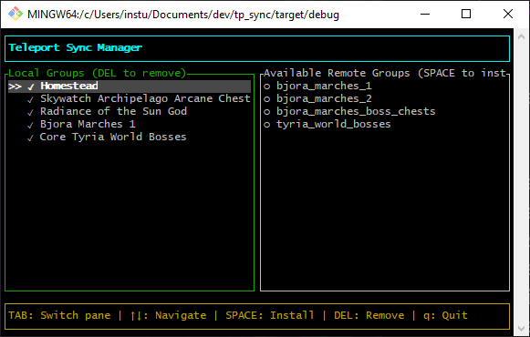

# Teleport Sync Manager

A tool for managing Guild Wars 2 teleport configurations.

## Usage

1. Run `tp_sync.exe`
2. On first run, select your `teleport.json` file (can be found in the `config` folder of your oktw installation)
3. Use arrow keys to navigate, Tab to switch panes
4. Press Space to install remote groups, Delete to remove local groups
5. Press Q to quit

## Config

Settings are stored in `config.toml` in the same folder as the executable.

## Notes
Requires a GW2 Restart in order to load the new teleport configurations
